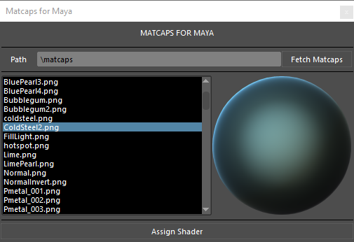

# Maya Matcaps

A Tool for utilizing matcaps in maya

Forked from the awesome work from kanishk
https://gist.github.com/kanishk2391/55a9e60b5fe351b65bc48c1016d9331f



## Run Using
```
matcap = MatcapBroswer()
matcap.show()
```

## Requirements

Autodesk Maya tested using Maya 2016 Windows and Linux but should work with all versions.

## Issues, feature requests, and contributions

* If you come across a problem please [file an issue](https://github.com/artbycrunk/maya-matcaps)
* Contributions are always welcome!
* Any and all feedback is appreciated and welcome!
  - If someone has already [filed an issue](https://github.com/artbycrunk/maya-matcaps) that encompasses your feedback, please leave a 👍/👎 reaction on the issue
  - Otherwise please file a new issue

## Release Notes

See [CHANGELOG.md](./CHANGELOG.md)

**Enjoy!**
